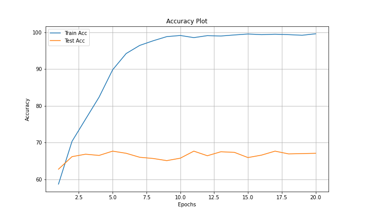
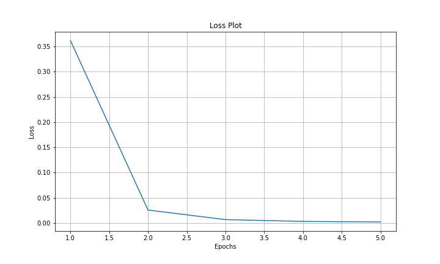

# BERT-Sarcasm-Detection

## Introduction

This repository contains the implementation and analysis for sarcasm detection using BERT. The project explores BERT's effectiveness in detecting sarcasm and provides insights into model performance and improvements. It includes data preprocessing, model training, and evaluation on the following datasets:

1. **News Headlines Dataset For Sarcasm Detection**: News Headlines from _The Onion_ and _HuffPost_ [Link](https://www.kaggle.com/datasets/rmisra/news-headlines-dataset-for-sarcasm-detection)
2. **Tweets with Sarcasm and Irony**: Tweets classified as irony, sarcasm or regular [Link](https://www.kaggle.com/datasets/nikhiljohnk/tweets-with-sarcasm-and-irony)
3. **Sarcasm on Reddit**: 1.3 million labelled comments from Reddit [Link](https://www.kaggle.com/datasets/danofer/sarcasm)

## Repository Structure

- **BERT**: Contains the entire code including the data pipeline, model, training and evaluation.
- **News_Headlines_Results**: Contains results for the News Headlines Dataset.
- **Reddit_Results**: Contains results for the Reddit Dataset.
- **Twitter_Results**: Contains results for the Twitter Dataset.

## Getting Started

### Prerequisites

- Python 3.7+
- CUDA 10.1 or higher (for GPU support)
- pip (Python package installer)

### Clone the Repository

```bash
git clone https://github.com/yourusername/BERT-Sarcasm-Detection.git
cd BERT-Sarcasm-Detection
```

### Set Up the Environment

1. **Create a virtual environment:**

   ```bash
   python -m venv venv
   source venv/bin/activate  # On Windows use `venv\Scripts\activate`
   ```

2. **Install the required packages:**

   ```bash
   pip install -r requirements.txt
   ```

### Dataset Preparation

Make sure the datasets are organized as follows:

```
Datasets/
|-- News_Headlines/
|
|-- Reddit/
|   |-- Comment/
|   |-- Comment_with_context/
|
|-- Twitter/
```

### Training the Models

#### Using Jupyter Notebook

1. **Navigate to the BERT directory:**

   ```bash
   cd BERT
   ```

2. **Launch Jupyter Notebook:**

   ```bash
   jupyter notebook
   ```

3. Open the main notebook and run the cells to start training.

#### Using Python Scripts

For running on a server or local machine without Jupyter:

1. **Navigate to the BERT directory:**

   ```bash
   cd BERT
   ```

2. **Run the training script:**

   ```bash
   python main.py
   ```

### Hyperparameters

You can set hyperparameters inside the `main.py` script. Typical hyperparameters you might want to adjust include:

- Learning rate
- Batch size
- Number of epochs
- Specific architecture details

### Model Description

#### BERT

BERT (Bidirectional Encoder Representations from Transformers) is a pre-trained transformer-based model designed to understand the context of words in a sentence by considering both the left and right context simultaneously. It achieves state-of-the-art performance on various natural language processing tasks through fine-tuning on specific tasks after initial training on a large corpus of text.


- **Architecture:**
  - The BERT (Bidirectional Encoder Representations from Transformers) architecture is based on the transformer model, specifically utilizing the transformer encoder. It consists of multiple layers of bidirectional self-attention mechanisms, enabling it to process input text by considering the context from both directions (left-to-right and right-to-left). Each layer comprises multi-head self-attention and feed-forward neural networks, followed by layer normalization and residual connections. BERT is designed to generate contextualized word embeddings that capture the nuanced meanings of words within different contexts.
  - We add a Linear layer at the end for classificaton.

## Results

Each of the `Results` directory contains:

- Main Notebook: The entire code to detect sarcasm for the given dataset.
- Failed Examples: Examples that the model failed to identify in JSON format.
- Progress Plots: Accuracy and loss plots for training and testing.

## Results

| Dataset        | Phase | Accuracy (%) |
| -------------- | ----- | ------------ |
| News Headlines | Train | 99.38        |
|                | Test  | 89.08        |
| Reddit         | Train | 99.62        |
|                | Test  | 67.08        |
| Twitter        | Train | 100.00       |
|                | Test  | 99.97        |

### News Headlines Results

The training and testing plots can be found at: `News_Headlines_Results'

Loss Plot:


Accuracy Plot:


### Reddit Results

The training and testing plots can be found at: `Reddit_Results'

Loss Plot:


Accuracy Plot:



### Twitter Results

The training and testing plots can be found at: `Twitter_Results'

Loss Plot:



Accuracy Plot:


## Future Scope

Future work could involve testing the Reddit dataset by incorporating the context of the parent comment or the subreddit it was posted on, or by including both. This approach could potentially enhance the accuracy of sarcasm detection. Additionally, experimenting with different pre-trained models and fine-tuning strategies may yield further improvements.

## Acknowledgments

- I gratefully acknowledge the creators and maintainers of the News Headlines, Reddit, and Twitter datasets for making these resources available.
- Inspired by the work on Transformers and BERT by leading researchers in the field.
